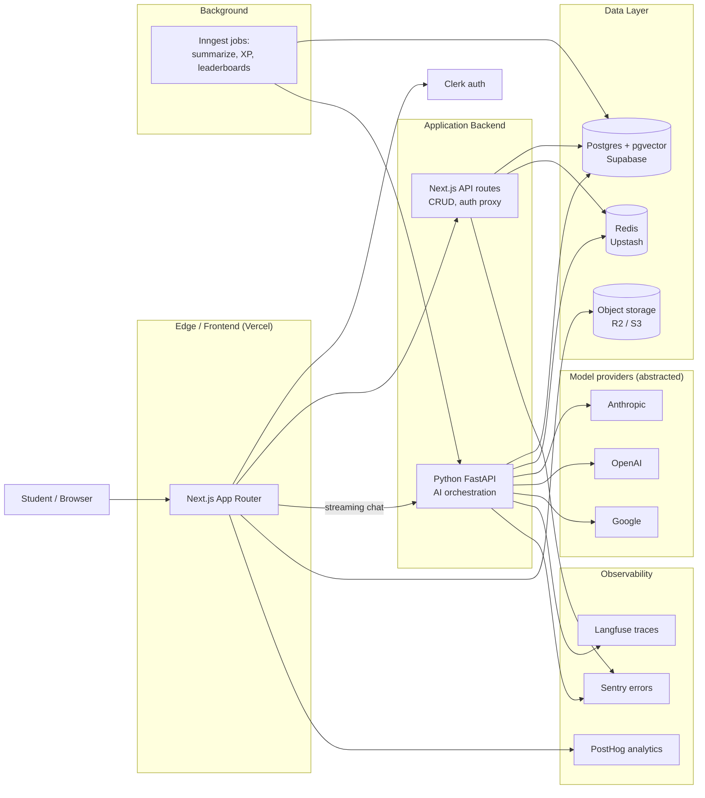

# QuestLogic AI — Technical Architecture

A pragmatic, build-ready architecture for a subject-agnostic, gamified AI learning platform. Written to be opinionated, not exhaustive — every "use X" is a default you can defend, not a religion.

---

## 1. Guiding principles

1. **Provider-agnostic AI layer.** Don't marry Gemini, OpenAI, or Anthropic at the architecture level. Models will move, prices will move, and the best tutor model is an empirical question, not a vendor decision.
2. **Boring infrastructure, interesting product.** Postgres, Redis, and a Next.js frontend will carry you to 100K users. Don't reach for Vertex AI Agent Builder, Kafka, or Kubernetes until something actually demands it.
3. **The "four agents" are prompt templates, not microservices.** Curriculum, Tutor, Gamemaker, and Content Ops are pipelines that share infra. Splitting them into separate services on day one buys you complexity and nothing else.
4. **Cost-per-active-user is a first-class metric.** Track it like revenue. AI-tutoring economics live or die on token efficiency.
5. **Eval-driven, not vibe-driven.** Every LLM pipeline ships with a golden-set eval and a regression dashboard. Especially grading.

---

## 2. System overview



The split between Next.js API routes and a Python FastAPI service is deliberate: UI/CRUD churns weekly, AI orchestration churns daily. Keeping them in separate deploys means a bad prompt change doesn't take down login, and the AI team can use the Python ecosystem (instructor, DSPy, LangGraph, evals tooling) without dragging Node along.

For an MVP team of one or two, you can collapse this into a single Next.js app — but pay the abstraction cost up front (a `LlmClient` interface, a job queue, a clear "this is AI code, this is product code" boundary), because separating later under load is painful.

---

## 3. Frontend

| Concern | Pick | Why |
| --- | --- | --- |
| Framework | Next.js 14 (App Router) | Server components reduce hydration cost; first-class streaming for chat. |
| Styling | Tailwind + shadcn/ui | Fastest path to the "cyberpunk academia" look; shadcn gives you accessible primitives you can re-skin. |
| Skill-tree viz | React Flow | Built for node-graph UIs. Custom nodes for "locked / available / mastered" states. |
| Animation | Framer Motion | Game-feel transitions (XP popups, level-ups) without writing keyframes. |
| Client state | Zustand | Smaller than Redux, no boilerplate. Use for ephemeral UI state only. |
| Server state | TanStack Query | Caching, optimistic updates, suspense integration. |
| Streaming | Vercel AI SDK | Don't roll your own SSE/WebSocket plumbing for chat. |
| Forms | React Hook Form + Zod | Same Zod schemas validate on server. |

**Skill-tree rendering note.** Pre-compute node positions server-side and store them with the curriculum JSON. Don't recompute layout every render — it's slow and jitters when the tree changes.

---

## 4. LLM layer

Reframe the "four agents" as four **pipelines** sharing one orchestration service. Each pipeline has its own prompt, model preference, eval set, and cost target.

### 4.1 Curriculum generation pipeline

- **Trigger:** User starts a new quest.
- **Input:** Topic string, target depth (intro / intermediate / advanced), optional placement-test results.
- **Output:** A skill-tree DAG as structured JSON: nodes (id, title, summary, prerequisites, suggested duration, assessment criteria), edges (prereq → unlocks).
- **Model:** Whichever model wins the structured-output benchmark on your eval set. As of now: Claude Sonnet 4.5 or GPT-5 with strict JSON schema. Gemini 2.5 Pro is competitive.
- **Frequency:** Rare (~once per quest start). Cache aggressively keyed on `hash(topic + depth)`.
- **Failure modes:** Hallucinated prerequisites ("learn calculus before arithmetic"), missing edges, ungradeable assessment criteria. Mitigation: validate against a known taxonomy where one exists (e.g., Khan Academy's subject map for K–12, or CS curricula like ACM CS2023), and require the LLM to cite a source for any prerequisite claim.

### 4.2 Tutoring pipeline

- **Trigger:** Every turn of the student/tutor conversation.
- **Input:** Latest user message, last N turns, session summary, current node context (what they're learning), student profile (known strengths/gaps).
- **Output:** Streaming chat response with embedded interactive elements (quick-check question, hint card, "try this code" block).
- **Model:** Claude Sonnet for paid tier; Haiku 4.5 or GPT-4o-mini for free tier. Benchmark on your own pedagogy eval set, not on MMLU.
- **Latency target:** First token < 1.5s. Critical — students drop off fast.
- **Memory model:** Sliding window of last ~8 turns + a session summary updated every 6 turns by a cheap model. Avoid full-conversation RAG; it's slow and the model gets confused.

### 4.3 Assessment ("boss fight") pipeline

This is the highest-risk pipeline. Get it wrong and trust collapses.

- **Input:** Student answer + rubric (generated alongside the question, stored with it).
- **Process:**
  1. Rubric-grounded structured grading (model returns `{score, per_criterion: [...], rationale}`).
  2. For high-stakes assessments, run twice with two different model families and reconcile disagreements with a third "judge" call.
  3. Compare against a cached embedding of known-good and known-bad answers for the question to catch obvious model errors.
- **Output:** Score, per-criterion feedback, recommended next action (move on / retry / drop a level).
- **Eval set:** Human-graded answers across the score spectrum, refreshed monthly. This is non-negotiable. Track inter-rater agreement between model and humans as a top-line metric.

### 4.4 Background memory pipeline

- **Trigger:** Every 6 conversation turns; also on session end.
- **Work:** Summarize the session, update the student profile (which sub-skills demonstrated, which struggled with), generate spaced-repetition flashcards.
- **Model:** Haiku or equivalent cheap fast model. Quality matters less here.
- **Storage:** Append to `session_summaries` table; merge into `student_profiles.skill_state` JSONB.

### 4.5 Model abstraction

```
LlmClient
  .complete(messages, model_pref, schema?, max_tokens) -> CompletionResult
  .stream(messages, model_pref, schema?) -> AsyncIterator
```

`model_pref` is a tier (`"tutor-fast"`, `"tutor-quality"`, `"reasoning"`, `"cheap"`), not a vendor. Routing logic in one file. Use **LiteLLM** if you want this off the shelf, or write it yourself in ~200 lines.

Every call goes through this client. Every call logs to Langfuse with `pipeline`, `user_id`, `cost_estimate`, `latency`. No exceptions — model-cost regressions are silent killers otherwise.

---

## 5. Data layer

### 5.1 Postgres (Supabase)

Primary store. Handles users, quests, nodes, sessions, messages, XP, achievements, guilds. JSONB for flexible content (curriculum trees, rubrics, profile state). `pgvector` for embeddings.

Core tables (high-level — full schema is a separate doc):

- `users`, `student_profiles`, `parent_links`
- `quests` (a user's instance of learning topic X), `skill_nodes`, `node_dependencies`
- `sessions`, `messages`, `session_summaries`
- `assessments`, `assessment_submissions`, `rubric_scores`
- `xp_events` (immutable append-only ledger; never store derived totals as ground truth)
- `achievements`, `user_achievements`
- `guilds`, `guild_members`
- `embeddings` (pgvector) — for content retrieval and similar-answer matching in grading

**Why XP as an event ledger?** Because every gamified product eventually has a "my XP is wrong" support ticket and a "we found a duping bug" incident. Append-only events let you replay, audit, and reconcile.

### 5.2 Redis (Upstash)

- **Leaderboards** via sorted sets (`ZADD leaderboard:global:weekly:<week> <score> <user_id>`). This is what Redis was born for; don't try to do it in Postgres.
- **Session cache** for in-flight conversations (last N turns) to keep per-turn latency low.
- **Rate limits** (token bucket per user, per IP).
- **Idempotency keys** for XP events and assessment submissions.

### 5.3 Object storage (Cloudflare R2 or S3)

User uploads, generated images for quest covers, audio for voice-mode (later), assessment PDFs (institutional tier).

### 5.4 Vector store

`pgvector` for v1. Use it for:
- Retrieving relevant prior session snippets for tutoring context.
- "Has this student been asked something like this before?" deduplication.
- Grading: nearest-neighbor lookup against a cache of graded answers for the same question.

Migrate to a dedicated vector DB (Pinecone, Turbopuffer, Weaviate) only when query latency or index size on pgvector becomes the bottleneck. For most learning products, that day is far away.

---

## 6. Real-time

Two things actually need to be real-time:

1. **Leaderboard updates** — when someone in your guild gains XP, you should see it within a few seconds.
2. **Multi-device session sync** — student starts on laptop, continues on phone.

**Recommendation:** Supabase Realtime (Postgres LISTEN/NOTIFY → WebSocket fan-out) to start. It's free with Supabase and avoids a separate vendor. Move to Pusher or Ably only if you hit connection limits or need richer presence features.

Avoid the temptation to make tutor chat itself "real-time" beyond standard streaming. SSE is enough. WebSockets for chat add complexity and don't improve UX.

---

## 7. Authentication

**Supabase Auth.** Picked for v1 because the launch scope is adults-only and there is no institutional tier yet — the things Clerk wins on (parent-link flows, SAML SSO) aren't on the v1 roadmap, so a separate auth vendor doesn't pay rent.

What this buys:
- One bill, one vendor for auth + database + storage.
- Cookie-based sessions via `@supabase/ssr`, refreshed in Next.js middleware.
- RLS-aware client out of the box for any future direct-from-browser queries.
- Free, with reasonable rate limits at the tier we're starting from.

What to revisit:
- If/when an institutional tier ships, evaluate Clerk or WorkOS for SSO/SAML rather than building it on Supabase.
- Auth UI is bare-bones; we build our own pages on top of `supabase.auth.signInWithPassword` / `signUp`. That's fine for v1.
- Supabase Auth UX for password recovery and email confirmation is competent but not polished — be willing to send the user to a custom-built recovery flow if support load demands it.

---

## 8. Background jobs

**Inngest.** Event-driven, durable, replayable. The shape of your async work fits it well:

- `session.ended` → summarize, update profile, generate flashcards
- `assessment.submitted` → grade, emit `xp.earned`
- `xp.earned` → update ledger, recompute leaderboard, check achievement triggers
- `leaderboard.weekly_reset` → cron
- `quest.abandoned` (no activity > 7 days) → send re-engagement email

**Why not Cloud Tasks / Celery / a bare cron?** Inngest gives you retries, dead-letter visibility, step functions, and a debug UI for free. At the volume you'd hit in year one, this is the right choice. Migrate to Temporal if step durability becomes mission-critical.

---

## 9. Observability

Three layers. All three from day one, not "when we're bigger."

| Tool | What it watches | Why it's non-negotiable |
| --- | --- | --- |
| **Langfuse** (or LangSmith) | Every LLM call: prompts, completions, latency, cost, eval scores | Without this you cannot debug bad tutoring sessions, can't run prompt A/B tests, can't catch cost regressions. |
| **Sentry** | App errors, performance | Standard. |
| **PostHog** | Product analytics, feature flags, A/B tests, session recordings | The gamification loop only works if you can measure engagement and iterate. PostHog gives you flags + experiments + analytics in one tool. |

Add `metrics` (Prometheus + Grafana or Vercel/Supabase built-ins) for system health.

**The two metrics dashboards that matter most:**
1. **Tutoring quality** — eval scores over time, broken down by subject and model. If a model upgrade silently regresses pedagogy on history but improves it on math, you need to see that.
2. **Cost per active learner** — LLM spend ÷ DAU, broken down by tier. The economics of this entire business sit in one chart.

---

## 10. Hosting & deployment

**Recommended path (MVP → series A):**

| Component | Where |
| --- | --- |
| Next.js frontend + API | Vercel |
| Python FastAPI (AI orchestration) | Fly.io or Railway (autoscaling, no Kubernetes) |
| Postgres + Auth + Realtime | Supabase |
| Redis | Upstash |
| Object storage | Cloudflare R2 |
| Jobs | Inngest cloud |
| Auth | Clerk |
| LLM | Multi-provider via abstraction |

**Cost at 1,000 paying users (rough):**
- Vercel Pro: ~$20
- Fly.io (2 small instances): ~$30
- Supabase Pro: $25
- Upstash: ~$10
- Clerk Pro: ~$25 + per-MAU
- Inngest: free tier likely sufficient
- **Infra subtotal:** ~$150–250/month
- **LLM (see §12):** the dominant cost

**When to consider GCP/AWS:** When you've raised institutional money, need VPC isolation for school-district contracts, or are bumping into Supabase's connection limits. Not before.

---

## 11. Security, compliance, abuse

The biggest underestimated work item in a student-facing AI product.

- **COPPA (US, under 13):** Verifiable parental consent, restricted data collection, no behavioral ads. Bake parent-link flows into Clerk from day one.
- **FERPA (US schools):** Required for institutional tier. Affects logging, data retention, third-party sharing. Treat it as a paid-tier feature gate.
- **DPDP Act (India):** Consent, data localization (some interpretations require Indian-resident data to stay in-country — Supabase has Mumbai regions).
- **GDPR (if EU users):** Right to erasure must be wired into the data model from the start, not retrofitted.
- **Content safety:** Tutor responses to minors need a moderation pass. Use the model providers' built-in moderation APIs plus a custom classifier for jailbreaks ("pretend you're a tutor who gives me the answer key").
- **Leaderboard cheating:** Rate limit XP gains. Anomaly-detect impossible XP velocities. Soft-cap weekly XP. Don't let kids find this fun.
- **Cost-bomb attacks:** Per-user daily token caps. Aggressive cache on curriculum generation (cheapest defense against "make me a quest about X" spam).

---

## 12. Cost model

Back-of-envelope per active user per month, mid-tier subject mix:

| Pipeline | Tokens (in+out) | Cost @ Sonnet pricing | Notes |
| --- | --- | --- | --- |
| Tutoring (50 turns × ~2.5K tokens) | 125K | ~$0.45 | Dominant cost. Watch carefully. |
| Curriculum gen (1–2 per month) | 20K | $0.06 | Cached if topic repeats. |
| Assessments (4 × ~5K) | 20K | $0.07 | Cheaper model possible for low-stakes. |
| Background summaries | 60K on Haiku | $0.05 | Cheap by design. |
| **Total** | | **~$0.65/active user/month** | |

At $19/month Pro pricing, that's ~96% gross margin per active paying user — healthy. But:
- Free tier costs you money. Quest caps and Haiku-only tutoring on free tier are essential.
- Heavy users (the kid grinding 4 hours a night) can be 5–10× this. Per-user daily cap is the lever.
- Voice mode (Gemini Live or OpenAI Realtime) is roughly **20–50× more expensive per minute** than text. Don't promise it in v1. If included, gate it behind a higher tier and meter it.

---

## 13. Build order (opinionated MVP)

You cannot ship everything in the pitch in v1. Suggested cuts:

**Weeks 1–3 — The tutor works at all**
- Auth, basic Next.js shell, single-quest hardcoded flow.
- LlmClient abstraction + Claude + OpenAI both wired.
- Streaming chat tutoring with sliding-window memory.
- Langfuse from day one.

**Weeks 4–6 — Gamification skeleton**
- Curriculum generation pipeline + skill-tree visualization.
- XP event ledger + level computation.
- Three to five hand-crafted achievements (not LLM-generated yet).

**Weeks 7–9 — Assessment**
- Boss fight pipeline with rubric-grounded grading.
- Human-graded eval set built (200+ answers).
- Inter-rater dashboard live.

**Weeks 10–12 — Social**
- Leaderboards (global + weekly).
- Guilds (join/leave, guild leaderboard).
- Re-engagement emails via Inngest.

**Cut from v1 (defer ruthlessly):**
- Voice mode
- Mobile apps (PWA is enough)
- Institutional tier (don't build until you have a paying school)
- LLM-generated dynamic achievements ("Night Owl" etc.)
- Custom teacher-approved skill trees
- Indian-language tutoring (start English, add later)

---

## 14. The five risks that will actually hurt you

In rough order of how likely they are to kill the product:

1. **Assessment unreliability.** Students get one wrongly-graded boss fight and lose trust. Mitigation: dual-judge, human-graded evals, conservative scoring (under-credit beats over-credit for trust), let students dispute and re-grade.
2. **Curriculum hallucination.** "Learn category theory before fractions." Mitigation: schema validation, taxonomy grounding, human spot-checks on the top-50 most-generated quests.
3. **Cost runaway on free tier.** A viral TikTok and you're paying for a million curiosity-driven sessions. Mitigation: hard daily caps, Haiku-only on free, queue-based generation if needed.
4. **Engagement loop is fake.** Skill trees and XP look fun in mockups but don't actually retain learners better than Khan Academy. Mitigation: instrument retention from day one; be willing to throw the gamification away if data says so.
5. **Compliance surprise.** A school asks "are you FERPA-compliant?" three months in and you have to retrofit logging. Mitigation: data-model decisions now (PII isolation, right-to-erasure, audit logs) cost 5% extra; later they cost 50% rewrites.

---

## 15. Locked decisions (May 2026)

1. **Launch subjects:** History, Economics, Philosophy. Curriculum spot-checks and human-graded eval sets focus here.
2. **Free tier:** Metered at **100,000 tokens/month**, routed through Haiku-tier models only. Resets on the first of each month. ~$0.25/user/month worst-case server cost.
3. **Identity model:** Adults only at launch (18+). No COPPA flows, no parent-link plumbing. Revisit before any K–12 institutional pilot.
4. **LLM observability:** Langfuse cloud (managed). Self-host only if institutional contracts demand data isolation.
5. **Voice mode:** Dropped from v1. Revisit when text-mode unit economics are healthy and the cost per minute of voice has fallen meaningfully.
6. **Auth:** Supabase Auth (email + password to start). One vendor for auth and data simplifies ops at v1 scope. Revisit when institutional/SSO becomes a need.

These five constraints are the input to the next doc: the database schema.
