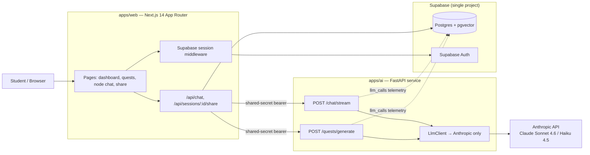

# QuestLogic — As-Built Architecture (July 2026)

This documents what is actually running in the `questlogic` codebase today, read directly from `apps/web`, `apps/ai`, and `packages/db`. It's a companion to `QuestLogic_Architecture.md` (the target-state design doc) and `QuestLogic_DB_Schema.md` (the full schema spec) — those describe where the product is headed; this describes where it is. The gap between the two is itself useful signal, so it's called out explicitly in §6.

---

## 1. System overview

Two deployables: the Next.js app and a Python FastAPI service, talking over plain HTTP with a shared-secret bearer token (`AI_SERVICE_SHARED_SECRET`) — no service mesh, no gateway. Next.js does all the database reads/writes; the AI service is stateless except for one thing: it writes its own row to `llm_calls` for cost telemetry. Everything else — session ownership checks, token-budget gating, message persistence — happens in the Next.js API route before and after it calls the AI service.

---

## 2. Frontend (`apps/web`)

Plain and small. `package.json` lists exactly: Next.js 14, React 18, Tailwind, `@supabase/ssr` + `@supabase/supabase-js`, `clsx`. None of the enrichments in the design doc are present — no React Flow, no Framer Motion, no Zustand, no TanStack Query, no Vercel AI SDK, no shadcn/ui.

- **Auth pages**: `/sign-in`, `/sign-up`, `/sign-up/check-email`, `/auth/callback`, `/auth/sign-out` — Supabase email/password, cookie sessions refreshed in `middleware.ts`.
- **`/dashboard`**: lists the user's quests (97 lines — a table/list, not a visual hub).
- **`/quests/new`**: form that posts subject + topic + depth to trigger curriculum generation.
- **`/quests/[questId]`**: renders the skill tree as `skill-tree-list.tsx` — a flat/ordered list with lock state, not a node-graph canvas.
- **`/quests/[questId]/nodes/[nodeId]`**: the tutoring surface — `chat-window.tsx` + `chat-bubble.tsx`, plain fetch-and-stream against `/api/chat` (no SSE library, no WebSocket).
- **`/share/[slug]`**: read-only public view of a single shared session, served via the service-role Supabase client.

Streaming is a raw `ReadableStream` teed in `/api/chat/route.ts`: one branch goes to the browser as it arrives, the other accumulates and is awaited-and-persisted to `messages` before the stream closes (a deliberate fix — the code comments note an earlier fire-and-forget version raced the *next* turn's history read).

---

## 3. AI orchestration service (`apps/ai`)

FastAPI, `httpx`/`asyncpg`/`anthropic` SDK, two routes total:

| Route | Pipeline | Purpose |
|---|---|---|
| `POST /quests/generate` | `curriculum.py` | Generate a 4–14 node skill-tree DAG as JSON for (subject, topic, depth) |
| `POST /chat/stream` | `tutor.py` | Stream one Socratic tutor turn for a given node |

**Model abstraction is real but single-provider.** `llm/client.py` has the shape the design doc calls for — pipelines ask for a `ModelTier` (`tutor-fast`, `tutor-quality`, `curriculum`, `cheap`), not a model name — but `llm/anthropic_provider.py` is the only provider implemented. Today `tutor-quality` and `curriculum` both resolve to the same model (`claude-sonnet-4-6`); `cheap` resolves to `claude-haiku-4-5-20251001` but **no pipeline currently requests the cheap tier** — there's no background-summary or grading pipeline calling it yet.

**Curriculum pipeline** (`curriculum.py`): one Sonnet call per generation, `max_tokens=2048`, strict-JSON system prompt, subject-specific guidance for history/economics/philosophy, a Pydantic model validating shape, a hand-rolled DFS cycle check, and one retry-with-error-feedback if validation fails. No caching by `hash(topic + depth)` yet — the design doc's caching recommendation isn't implemented, so identical topic requests regenerate from scratch.

**Tutor pipeline** (`tutor.py`): no RAG, no vector retrieval, no `user_memory_chunks` reads despite the table existing. Memory is just the last 6 messages (3 exchanges) pulled fresh from Postgres per turn by the Next.js route and passed in. The system prompt is large and carefully tuned (confidence-reading rules, a hard cap on Socratic loop depth, an explicit "first sentence must engage with the student's literal last message" instruction) — this prompt, not any memory or retrieval system, is currently doing the pedagogical heavy lifting. A `kickoff` flag handles session-open turns by synthesizing an invisible first user turn, since Claude's API requires a user turn to respond to.

**No assessment pipeline.** "Boss fights," rubric grading, and dual-judge reconciliation described in the design doc have no corresponding code — `template_assessments`, `assessment_attempts`, and `grade_runs` tables exist in the schema but nothing writes to them.

---

## 4. Data layer

Single Supabase project. `packages/db/migrations/0001_init.sql` creates the **entire** v1 schema from `QuestLogic_DB_Schema.md` in one shot — all 24 tables, including gamification, guilds, and leaderboards — via a plain idempotent SQL script (not a migration-tool chain; `0002` seeds subjects/achievements, `0003` adds session sharing).

The schema is materially ahead of the application code:

| Exists in schema | Exercised by app code today |
|---|---|
| `app.users`, `student_profiles`, `subjects` | Yes |
| `curriculum_templates`, `template_nodes`, `template_edges` | Yes |
| `quests`, `node_progress` | Partially (quest creation confirmed; node-progress transitions not traced in the routes reviewed) |
| `sessions`, `messages` | Yes |
| `llm_calls`, `user_token_budgets` | Yes |
| `template_assessments`, `assessment_attempts`, `grade_runs`, `rubric_criterion_scores` | No |
| `xp_events`, `achievements`, `user_achievements` | No (achievements are seeded, never awarded) |
| `guilds`, `guild_members`, `leaderboard_periods`, `leaderboard_snapshots` | No |
| `user_memory_chunks` (pgvector) | No |

One naming inconsistency worth fixing: the schema doc's comment calls `app.users` a "Clerk mirror," but the actual migration correctly references `auth.users(id)` — this is a **Supabase Auth** mirror. Auth is Supabase end-to-end (confirmed in `utils/supabase/*` and `lib/user.ts`); Clerk is not wired in anywhere in the code, despite being named in the design doc's hosting table.

No Redis, no Inngest, no Langfuse, no Sentry, no PostHog — none of §5–9 of the design doc's infrastructure has a corresponding dependency in either `package.json`. Token-budget enforcement is a direct Postgres read on every chat request (`user_token_budgets`), not the Redis-counter fast path the design doc recommends.

---

## 5. Auth & security as implemented

- Supabase Auth, email/password, session cookies refreshed via `@supabase/ssr` in `middleware.ts`.
- `lib/user.ts` lazily mirrors the Supabase auth user into `app.users`, creates a `student_profiles` row, and upserts a `user_token_budgets` row for the current month with `tokens_limit` from `FREE_TIER_TOKENS_PER_MONTH` (defaults to 100,000 — matches the locked decision in the design doc).
- Web ↔ AI service auth is a single static bearer secret, checked with a plain string compare in `auth.py`. No per-request signing, no rotation, no scoping — adequate for a two-service internal call, not something to expose beyond that.
- No content moderation layer on tutor output, no rate limiting beyond the monthly token budget, no COPPA/FERPA handling — none of these are expected yet given the "adults only, v1" scope, but they're also not stubbed.

---

## 6. Delta from the target-state design doc

Concrete, checkable gaps — useful as a punch list, not a criticism:

1. **Single LLM provider.** The `LlmClient` abstraction exists and is provider-agnostic by design, but only Anthropic is implemented. OpenAI/Gemini routing is zero-cost to add later (mirror `anthropic_provider.py`) but isn't there now.
2. **No caching on curriculum generation.** Every "new quest" for a repeated (subject, topic, depth) re-generates and re-spends tokens.
3. **No background memory/summary pipeline.** `sessions.summary`, `sessions.summary_model` columns exist and are unused. Context is a raw 6-message window only.
4. **No assessment/grading pipeline.** The riskiest pipeline in the design doc (dual-judge grading) doesn't exist yet — there's no "boss fight" flow at all.
5. **No gamification loop.** XP, achievements, streaks, guilds, leaderboards are fully speced in the schema and completely inert in the product. The dashboard shows quests; it does not show XP or achievements.
6. **No observability stack.** No Langfuse, Sentry, or PostHog. The only signal is the `llm_calls` table — no dashboards, no alerting, no eval harness.
7. **No caching/Redis, no background jobs/Inngest.** Token budget checks are synchronous Postgres reads; there's no leaderboard infra to need Redis yet, so this is a lower-priority gap.
8. **The `llm_calls` cost-telemetry numbers are wrong by roughly an order of magnitude** — see §7. This is the one gap worth fixing before it's relied on for a real decision.

None of this reads as behind schedule for a v0 — it reads like a team that shipped the tutoring loop first and left the schema pre-built for the next slices. The risk is only that `QuestLogic_Architecture.md` and `QuestLogic_DB_Schema.md` are easy to mistake for "what's running" rather than "what's planned."

---

## 7. Inference cost — per topic

"Per topic" = one quest end-to-end: one curriculum-generation call, plus tutoring turns across every node in that quest's skill tree until the student masters it. All figures below use **current Anthropic list pricing**, not the numbers baked into `apps/ai/src/questlogic_ai/llm/pricing.py`.

**Finding worth flagging first:** the app's own pricing table is stale and overstates cost by roughly 8–10×:

| Model | `pricing.py` today | Actual Anthropic list price | Overstatement |
|---|---|---|---|
| `claude-sonnet-4-6` | $30 / $150 per M tok (in/out) | $3 / $15 per M tok | ~10× |
| `claude-haiku-4-5` | $8 / $40 per M tok | $1 / $5 per M tok | ~8× |

Every `cost_micros` value written to `llm_calls` today is roughly an order of magnitude too high. If anyone pulls a "cost per active user" number from that table right now, divide by ~8–10 before trusting it. This is a one-line fix (update the dict in `pricing.py`) and worth doing before it feeds any pricing or fundraising decision.

### Per-call cost, using real prompt sizes from the code

| Call type | Est. input tokens | Est. output tokens | Cost @ real pricing |
|---|---|---|---|
| Curriculum generation (1 call, 6–8 node tree) | ~700 | ~1,200 (near the 2,048 cap) | ~$0.02 |
| Tutor turn, kickoff (session open, no history) | ~1,150 (large system prompt + kickoff block) | ~250 (150–200 word intro) | ~$0.007 |
| Tutor turn, steady-state (system prompt + ~3 turns of history) | ~1,600 | ~180 (~120-word target reply) | ~$0.007–0.008 |

The tutor's system prompt is the dominant input cost per call — it's long and reloaded in full on every single turn (no prompt caching is configured in `anthropic_provider.py`, though Anthropic's API supports it and would meaningfully cut this, since the system prompt is identical across turns within a node and largely shared across nodes in the same subject).

### Rolled up to one topic

Assuming a mid-size skill tree (7 nodes) and an engaged student who takes roughly 8 tutor turns per node to reach mastery (1 kickoff + 7 exchanges) — a real range will vary a lot by student, so treat this as the "typical, not minimum or maximum" case:

| Component | Count | Cost |
|---|---|---|
| Curriculum generation | 1 | $0.02 |
| Tutor turns | 7 nodes × 8 turns = 56 | 56 × ~$0.0075 ≈ $0.42 |
| **Total per topic** | | **≈ $0.44** |

Sensitivity:
- A light-touch topic (4 nodes, 4 turns/node = 16 turns): **≈ $0.14**.
- A heavily-explored topic (14 nodes, 12 turns/node = 168 turns): **≈ $1.28**.
- Curriculum-gen cost is a rounding error either way (~2–5% of topic cost) — tutoring dominates, as the design doc anticipated, but the multiplier from unbounded turn count matters more here since there's no per-session cap in the current code.

At the free-tier default of 100,000 tokens/month (~$0.30–0.40 of Sonnet-priced usage per user if it's all spent on tutoring, since there's no Haiku routing for free-tier yet), a free user can burn through roughly **one typical topic's worth of tutoring per month** before hitting the cap — worth knowing, since the design doc assumed free-tier would run on Haiku specifically, and that routing isn't implemented.

**Biggest available lever not yet used:** since `cheap` (Haiku 4.5, $1/$5 per M) is wired into `LlmClient` but never called, routing free-tier tutoring or the kickoff/low-stakes turns to it would cut the dominant cost line by roughly 3× with no new code beyond changing which tier a pipeline requests.

---

## 8. Summary

The shipped system is a lean, working slice: auth, curriculum generation, and Socratic tutoring, on one model provider, with a schema built out for a much larger product than currently runs against it. That's a reasonable sequencing choice for a v0 — get the tutoring loop right before building gamification on top of it — but the cost-telemetry pricing bug and the unused `cheap` tier are the two changes with the best ratio of effort to payoff before scaling usage.
