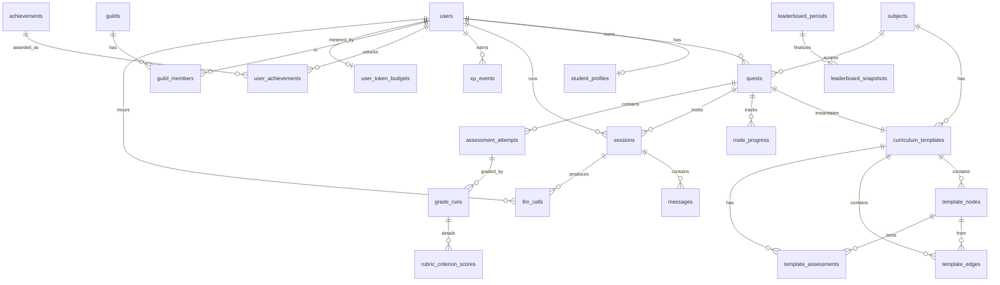

# QuestLogic AI — Database Schema (v1)

Postgres-on-Supabase schema for the v1 product. Designed against the locked decisions in the architecture doc: launch subjects are history, economics, philosophy; free tier is 100K tokens/month on Haiku-tier; adults only; cloud Langfuse; no voice.

This is the canonical reference. Application code, migrations, and the AI orchestration service should all read from here. If something here disagrees with the code, this doc wins or gets a PR.

---

## 1. Design principles

1. **Separate templates from instances.** Curriculum content is shared across users; per-user progress is not. This keeps the curriculum table small, makes regeneration cheap, and survives versioning.
2. **Append-only ledgers for state that matters.** XP and LLM cost are events, not balances. Derived totals live in cache or materialized views, never as the source of truth.
3. **JSONB where the shape is fluid, columns where it isn't.** Curriculum nodes, rubrics, achievement criteria, profile skill-state — JSONB. User IDs, timestamps, status enums — columns.
4. **Every cost-incurring action is traceable.** Every LLM call has a row tying it to a user, a session, a pipeline, a model, and a Langfuse trace ID. No orphan spend.
5. **GDPR erasure is wired in from day one.** ON DELETE CASCADE on user-owned rows; nullable + anonymizable user_id on analytics-relevant rows (xp_events, llm_calls).

---

## 2. Entity-relationship overview



---

## 3. Conventions

- **Primary keys:** `uuid`, default `gen_random_uuid()`.
- **Foreign keys:** explicit, named `<entity>_id`.
- **Timestamps:** `timestamptz`, default `now()`. Every table has `created_at` and `updated_at` (touch via trigger).
- **Soft delete:** `deleted_at timestamptz` where user-facing recoverability matters (sessions, quests, messages). Hard delete on GDPR erasure.
- **Money:** integer **micro-cents** (`bigint`). $0.01 = 10,000. No floats anywhere in cost math.
- **Enums:** Postgres enums for stable status sets; `text` with a `CHECK` constraint where the set is still moving.
- **Schemas:** everything in `public`; auth-mirror in its own schema `app`.
- **RLS:** on by default for every user-owned table. Service role for backend; `auth.uid()` for end-user access.

---

## 4. Identity & profile

### `users` — minimal Clerk mirror

```sql
CREATE TYPE user_tier AS ENUM ('free', 'pro', 'institutional');

CREATE TABLE app.users (
  id              uuid PRIMARY KEY DEFAULT gen_random_uuid(),
  clerk_user_id   text UNIQUE NOT NULL,
  email           citext UNIQUE NOT NULL,
  display_name    text,
  locale          text NOT NULL DEFAULT 'en-US',
  timezone        text NOT NULL DEFAULT 'UTC',
  tier            user_tier NOT NULL DEFAULT 'free',
  tier_updated_at timestamptz NOT NULL DEFAULT now(),
  created_at      timestamptz NOT NULL DEFAULT now(),
  updated_at      timestamptz NOT NULL DEFAULT now(),
  deleted_at      timestamptz
);

CREATE INDEX users_tier_idx ON app.users(tier) WHERE deleted_at IS NULL;
```

### `student_profiles` — learning state, one per user

```sql
CREATE TABLE student_profiles (
  user_id           uuid PRIMARY KEY REFERENCES app.users(id) ON DELETE CASCADE,
  total_xp          bigint NOT NULL DEFAULT 0,        -- cached; truth is xp_events
  current_level     int    NOT NULL DEFAULT 1,         -- derived; cached for speed
  current_streak    int    NOT NULL DEFAULT 0,
  longest_streak    int    NOT NULL DEFAULT 0,
  last_active_at    timestamptz,
  preferred_subjects text[] NOT NULL DEFAULT ARRAY[]::text[],
  skill_state       jsonb  NOT NULL DEFAULT '{}'::jsonb,  -- {node_slug: {confidence: 0-1, last_seen}}
  created_at        timestamptz NOT NULL DEFAULT now(),
  updated_at        timestamptz NOT NULL DEFAULT now()
);

CREATE INDEX student_profiles_last_active_idx ON student_profiles(last_active_at DESC);
```

`total_xp` and `current_level` are caches. The ground truth is the sum of `xp_events`. Recompute on a schedule; never trust this column for billing or fraud checks.

---

## 5. Subjects & curriculum

### `subjects` — fixed enum at v1

```sql
CREATE TABLE subjects (
  id          uuid PRIMARY KEY DEFAULT gen_random_uuid(),
  slug        text UNIQUE NOT NULL,          -- 'history' | 'economics' | 'philosophy'
  name        text NOT NULL,
  description text,
  color_hex   text,
  icon_slug   text,
  is_active   boolean NOT NULL DEFAULT true,
  created_at  timestamptz NOT NULL DEFAULT now()
);

INSERT INTO subjects (slug, name, description, color_hex) VALUES
  ('history',    'History',    'Civilizations, eras, primary sources, causation.',   '#FF6B6B'),
  ('economics',  'Economics',  'Micro and macro, markets, policy, decision theory.', '#4ECDC4'),
  ('philosophy','Philosophy','Logic, ethics, metaphysics, argument and inquiry.',    '#9B59B6');
```

### `curriculum_templates` — shared across users

```sql
CREATE TYPE template_status AS ENUM ('draft', 'active', 'deprecated');

CREATE TABLE curriculum_templates (
  id              uuid PRIMARY KEY DEFAULT gen_random_uuid(),
  subject_id      uuid NOT NULL REFERENCES subjects(id),
  topic           text NOT NULL,
  depth           text NOT NULL CHECK (depth IN ('intro','intermediate','advanced')),
  content_hash    text NOT NULL,                -- hash(topic + depth + generator_version)
  version         int  NOT NULL DEFAULT 1,
  status          template_status NOT NULL DEFAULT 'active',
  generator_model text NOT NULL,
  generated_by    uuid REFERENCES app.users(id), -- null for system-seeded
  metadata        jsonb NOT NULL DEFAULT '{}'::jsonb,
  created_at      timestamptz NOT NULL DEFAULT now(),
  UNIQUE (content_hash, version)
);

CREATE INDEX curriculum_templates_lookup_idx
  ON curriculum_templates (subject_id, topic, depth, status);
```

### `template_nodes` — DAG nodes

```sql
CREATE TABLE template_nodes (
  id              uuid PRIMARY KEY DEFAULT gen_random_uuid(),
  template_id     uuid NOT NULL REFERENCES curriculum_templates(id) ON DELETE CASCADE,
  slug            text NOT NULL,                 -- unique within template
  title           text NOT NULL,
  summary         text NOT NULL,
  content         jsonb NOT NULL DEFAULT '{}'::jsonb,  -- subject-specific (timeline span, schools of thought, etc.)
  position_x      float4,                        -- pre-computed layout for React Flow
  position_y      float4,
  order_hint      int  NOT NULL DEFAULT 0,
  depth_level     int  NOT NULL DEFAULT 0,       -- 0 = entry point
  estimated_minutes int,
  created_at      timestamptz NOT NULL DEFAULT now(),
  UNIQUE (template_id, slug)
);

CREATE INDEX template_nodes_template_idx ON template_nodes(template_id);
```

### `template_edges` — prereqs

```sql
CREATE TYPE edge_type AS ENUM ('prereq', 'optional', 'related');

CREATE TABLE template_edges (
  id            uuid PRIMARY KEY DEFAULT gen_random_uuid(),
  template_id   uuid NOT NULL REFERENCES curriculum_templates(id) ON DELETE CASCADE,
  from_node_id  uuid NOT NULL REFERENCES template_nodes(id) ON DELETE CASCADE,
  to_node_id    uuid NOT NULL REFERENCES template_nodes(id) ON DELETE CASCADE,
  edge_kind     edge_type NOT NULL DEFAULT 'prereq',
  created_at    timestamptz NOT NULL DEFAULT now(),
  CHECK (from_node_id <> to_node_id),
  UNIQUE (template_id, from_node_id, to_node_id)
);

CREATE INDEX template_edges_to_idx ON template_edges(to_node_id);
```

### `template_assessments` — boss-fight question bank

```sql
CREATE TABLE template_assessments (
  id              uuid PRIMARY KEY DEFAULT gen_random_uuid(),
  template_id     uuid NOT NULL REFERENCES curriculum_templates(id) ON DELETE CASCADE,
  node_id         uuid NOT NULL REFERENCES template_nodes(id) ON DELETE CASCADE,
  question        text NOT NULL,
  question_type   text NOT NULL CHECK (question_type IN ('short_answer','essay','dialogue')),
  rubric          jsonb NOT NULL,    -- [{criterion, weight, exemplars}]
  difficulty      int  NOT NULL DEFAULT 3 CHECK (difficulty BETWEEN 1 AND 5),
  reference_answer text,             -- gold-standard for grader calibration
  created_at      timestamptz NOT NULL DEFAULT now()
);

CREATE INDEX template_assessments_node_idx ON template_assessments(node_id);
```

---

## 6. Quests & per-user progress

### `quests` — a user's instance of a template

```sql
CREATE TYPE quest_status AS ENUM ('active', 'paused', 'completed', 'abandoned');

CREATE TABLE quests (
  id              uuid PRIMARY KEY DEFAULT gen_random_uuid(),
  user_id         uuid NOT NULL REFERENCES app.users(id) ON DELETE CASCADE,
  subject_id      uuid NOT NULL REFERENCES subjects(id),
  template_id     uuid NOT NULL REFERENCES curriculum_templates(id),
  title           text NOT NULL,
  status          quest_status NOT NULL DEFAULT 'active',
  started_at      timestamptz NOT NULL DEFAULT now(),
  completed_at    timestamptz,
  last_active_at  timestamptz NOT NULL DEFAULT now(),
  deleted_at      timestamptz,
  metadata        jsonb NOT NULL DEFAULT '{}'::jsonb
);

CREATE INDEX quests_user_active_idx
  ON quests(user_id, last_active_at DESC)
  WHERE deleted_at IS NULL;
```

### `node_progress` — per (quest, template_node)

```sql
CREATE TYPE node_status AS ENUM ('locked','available','in_progress','mastered','failed');

CREATE TABLE node_progress (
  id                uuid PRIMARY KEY DEFAULT gen_random_uuid(),
  quest_id          uuid NOT NULL REFERENCES quests(id) ON DELETE CASCADE,
  user_id           uuid NOT NULL REFERENCES app.users(id) ON DELETE CASCADE,
  template_node_id  uuid NOT NULL REFERENCES template_nodes(id),
  status            node_status NOT NULL DEFAULT 'locked',
  attempts          int NOT NULL DEFAULT 0,
  last_score        numeric(4,3),    -- 0.000 to 1.000
  best_score        numeric(4,3),
  started_at        timestamptz,
  mastered_at       timestamptz,
  created_at        timestamptz NOT NULL DEFAULT now(),
  updated_at        timestamptz NOT NULL DEFAULT now(),
  UNIQUE (quest_id, template_node_id)
);

CREATE INDEX node_progress_user_status_idx ON node_progress(user_id, status);
```

---

## 7. Sessions & messages

### `sessions` — a single learning sitting

```sql
CREATE TABLE sessions (
  id               uuid PRIMARY KEY DEFAULT gen_random_uuid(),
  user_id          uuid NOT NULL REFERENCES app.users(id) ON DELETE CASCADE,
  quest_id         uuid REFERENCES quests(id) ON DELETE SET NULL,
  current_node_id  uuid REFERENCES template_nodes(id),
  started_at       timestamptz NOT NULL DEFAULT now(),
  ended_at         timestamptz,
  summary          text,                       -- LLM-generated rollup
  summary_model    text,
  summary_updated_at timestamptz,
  message_count    int NOT NULL DEFAULT 0,
  tokens_used      bigint NOT NULL DEFAULT 0,  -- cached aggregate
  share_slug       text UNIQUE,                -- set when the student publishes a read-only link
  shared_at        timestamptz,
  deleted_at       timestamptz
);

CREATE INDEX sessions_user_recent_idx ON sessions(user_id, started_at DESC);
CREATE INDEX sessions_quest_idx ON sessions(quest_id);
CREATE INDEX sessions_share_slug_idx ON sessions(share_slug) WHERE share_slug IS NOT NULL;
```

Sharing is per-session, i.e. per sub-topic: a student can publish one node's tutoring chat (`/share/<slug>`) without exposing the rest of the quest. `share_slug` is a random URL-safe token, nulled out on unshare (0003_session_sharing.sql). The public route reads via the service-role client and only ever selects `user`/`assistant` messages.

### `messages` — chat turns

```sql
CREATE TYPE message_role AS ENUM ('user','assistant','system','tool');

CREATE TABLE messages (
  id          uuid PRIMARY KEY DEFAULT gen_random_uuid(),
  session_id  uuid NOT NULL REFERENCES sessions(id) ON DELETE CASCADE,
  user_id     uuid NOT NULL REFERENCES app.users(id) ON DELETE CASCADE,
  role        message_role NOT NULL,
  content     text NOT NULL,
  tokens_in   int,
  tokens_out  int,
  model       text,
  pipeline    text,                       -- 'tutor' | 'curriculum' | 'grader' | 'summary'
  langfuse_trace_id text,
  created_at  timestamptz NOT NULL DEFAULT now(),
  deleted_at  timestamptz
);

CREATE INDEX messages_session_order_idx ON messages(session_id, created_at);
```

### `user_memory_chunks` — for retrieval across sessions

```sql
CREATE TABLE user_memory_chunks (
  id          uuid PRIMARY KEY DEFAULT gen_random_uuid(),
  user_id     uuid NOT NULL REFERENCES app.users(id) ON DELETE CASCADE,
  quest_id    uuid REFERENCES quests(id) ON DELETE CASCADE,
  source_session_id uuid REFERENCES sessions(id) ON DELETE SET NULL,
  chunk_type  text NOT NULL CHECK (chunk_type IN ('summary','insight','struggle','preference')),
  content     text NOT NULL,
  embedding   vector(1536),                  -- pgvector, OpenAI ada-002 size or Cohere
  embedding_model text NOT NULL,
  created_at  timestamptz NOT NULL DEFAULT now()
);

CREATE INDEX user_memory_chunks_user_idx ON user_memory_chunks(user_id);
CREATE INDEX user_memory_chunks_embedding_idx
  ON user_memory_chunks USING ivfflat (embedding vector_cosine_ops)
  WITH (lists = 100);
```

---

## 8. Assessments ("boss fights")

### `assessment_attempts` — student's run at a node assessment

```sql
CREATE TYPE attempt_status AS ENUM ('in_progress','submitted','graded','disputed','resolved');

CREATE TABLE assessment_attempts (
  id              uuid PRIMARY KEY DEFAULT gen_random_uuid(),
  user_id         uuid NOT NULL REFERENCES app.users(id) ON DELETE CASCADE,
  quest_id        uuid NOT NULL REFERENCES quests(id) ON DELETE CASCADE,
  template_assessment_id uuid NOT NULL REFERENCES template_assessments(id),
  status          attempt_status NOT NULL DEFAULT 'in_progress',
  student_answer  text,
  final_score     numeric(4,3),     -- 0.000 to 1.000, after grade reconciliation
  feedback        text,
  started_at      timestamptz NOT NULL DEFAULT now(),
  submitted_at    timestamptz,
  graded_at       timestamptz
);

CREATE INDEX assessment_attempts_user_idx ON assessment_attempts(user_id, started_at DESC);
CREATE INDEX assessment_attempts_quest_idx ON assessment_attempts(quest_id);
```

### `grade_runs` — multiple grader calls per attempt

```sql
CREATE TABLE grade_runs (
  id              uuid PRIMARY KEY DEFAULT gen_random_uuid(),
  attempt_id      uuid NOT NULL REFERENCES assessment_attempts(id) ON DELETE CASCADE,
  grader_role     text NOT NULL CHECK (grader_role IN ('primary','secondary','judge','human')),
  grader_model    text,
  score           numeric(4,3) NOT NULL,
  rationale       text,
  langfuse_trace_id text,
  created_at      timestamptz NOT NULL DEFAULT now()
);

CREATE INDEX grade_runs_attempt_idx ON grade_runs(attempt_id);
```

### `rubric_criterion_scores` — per-criterion breakdown

```sql
CREATE TABLE rubric_criterion_scores (
  id            uuid PRIMARY KEY DEFAULT gen_random_uuid(),
  grade_run_id  uuid NOT NULL REFERENCES grade_runs(id) ON DELETE CASCADE,
  criterion_key text NOT NULL,
  weight        numeric(4,3) NOT NULL,
  score         numeric(4,3) NOT NULL,
  evidence      text
);

CREATE INDEX rubric_criterion_grade_idx ON rubric_criterion_scores(grade_run_id);
```

---

## 9. Gamification

### `xp_events` — the source of truth

```sql
CREATE TYPE xp_source AS ENUM (
  'message_quality','node_started','node_mastered','assessment_passed',
  'streak_bonus','achievement','manual_adjustment'
);

CREATE TABLE xp_events (
  id            uuid PRIMARY KEY DEFAULT gen_random_uuid(),
  user_id       uuid REFERENCES app.users(id) ON DELETE SET NULL,  -- nullable for erasure preservation
  amount        int  NOT NULL,
  source_type   xp_source NOT NULL,
  source_id     uuid,                     -- polymorphic ref
  metadata      jsonb NOT NULL DEFAULT '{}'::jsonb,
  idempotency_key text UNIQUE,            -- prevents dupes from retries
  created_at    timestamptz NOT NULL DEFAULT now()
);

CREATE INDEX xp_events_user_time_idx ON xp_events(user_id, created_at DESC);
CREATE INDEX xp_events_source_idx ON xp_events(source_type, source_id);
```

Note that `user_id` is `ON DELETE SET NULL` — when a user is GDPR-erased, the XP events stay for analytics and aggregate-leaderboard integrity, but become unattributable.

### `achievements` & `user_achievements`

```sql
CREATE TABLE achievements (
  id          uuid PRIMARY KEY DEFAULT gen_random_uuid(),
  slug        text UNIQUE NOT NULL,         -- 'first_quest','five_day_streak','philosophy_apprentice'
  name        text NOT NULL,
  description text NOT NULL,
  icon_slug   text,
  category    text NOT NULL,                -- 'progress','social','streak','mastery'
  criteria    jsonb NOT NULL,               -- machine-checkable spec
  xp_reward   int NOT NULL DEFAULT 0,
  is_secret   boolean NOT NULL DEFAULT false,
  is_active   boolean NOT NULL DEFAULT true,
  created_at  timestamptz NOT NULL DEFAULT now()
);

CREATE TABLE user_achievements (
  id              uuid PRIMARY KEY DEFAULT gen_random_uuid(),
  user_id         uuid NOT NULL REFERENCES app.users(id) ON DELETE CASCADE,
  achievement_id  uuid NOT NULL REFERENCES achievements(id),
  earned_at       timestamptz NOT NULL DEFAULT now(),
  metadata        jsonb NOT NULL DEFAULT '{}'::jsonb,
  UNIQUE (user_id, achievement_id)
);

CREATE INDEX user_achievements_user_idx ON user_achievements(user_id, earned_at DESC);
```

---

## 10. Social — guilds & leaderboards

### `guilds`

```sql
CREATE TYPE guild_visibility AS ENUM ('public','invite_only','private');

CREATE TABLE guilds (
  id          uuid PRIMARY KEY DEFAULT gen_random_uuid(),
  slug        text UNIQUE NOT NULL,
  name        text NOT NULL,
  description text,
  visibility  guild_visibility NOT NULL DEFAULT 'public',
  member_count int NOT NULL DEFAULT 0,       -- cached
  created_by  uuid REFERENCES app.users(id) ON DELETE SET NULL,
  created_at  timestamptz NOT NULL DEFAULT now()
);

CREATE TABLE guild_members (
  id        uuid PRIMARY KEY DEFAULT gen_random_uuid(),
  guild_id  uuid NOT NULL REFERENCES guilds(id) ON DELETE CASCADE,
  user_id   uuid NOT NULL REFERENCES app.users(id) ON DELETE CASCADE,
  role      text NOT NULL DEFAULT 'member' CHECK (role IN ('member','officer','owner')),
  joined_at timestamptz NOT NULL DEFAULT now(),
  UNIQUE (guild_id, user_id)
);

CREATE INDEX guild_members_user_idx ON guild_members(user_id);
```

### `leaderboard_periods` & `leaderboard_snapshots`

Live leaderboards live in Redis sorted sets. These tables record final standings at period close for historical pages and badge logic.

```sql
CREATE TABLE leaderboard_periods (
  id            uuid PRIMARY KEY DEFAULT gen_random_uuid(),
  period_type   text NOT NULL CHECK (period_type IN ('weekly','monthly','all_time')),
  scope         text NOT NULL CHECK (scope IN ('global','guild','subject')),
  scope_ref_id  uuid,                          -- guild_id or subject_id; null for global
  period_start  timestamptz NOT NULL,
  period_end    timestamptz NOT NULL,
  finalized_at  timestamptz,
  UNIQUE (period_type, scope, scope_ref_id, period_start)
);

CREATE TABLE leaderboard_snapshots (
  id            uuid PRIMARY KEY DEFAULT gen_random_uuid(),
  period_id     uuid NOT NULL REFERENCES leaderboard_periods(id) ON DELETE CASCADE,
  user_id       uuid REFERENCES app.users(id) ON DELETE SET NULL,
  rank          int  NOT NULL,
  xp_earned     bigint NOT NULL,
  created_at    timestamptz NOT NULL DEFAULT now()
);

CREATE INDEX leaderboard_snapshots_period_rank_idx
  ON leaderboard_snapshots(period_id, rank);
```

---

## 11. Cost metering & LLM telemetry

### `llm_calls` — every call

```sql
CREATE TABLE llm_calls (
  id                uuid PRIMARY KEY DEFAULT gen_random_uuid(),
  user_id           uuid REFERENCES app.users(id) ON DELETE SET NULL,
  session_id        uuid REFERENCES sessions(id) ON DELETE SET NULL,
  pipeline          text NOT NULL,        -- 'tutor','curriculum','grader','summary'
  model             text NOT NULL,
  provider          text NOT NULL,        -- 'anthropic','openai','google'
  tokens_in         int NOT NULL,
  tokens_out        int NOT NULL,
  cost_micros       bigint NOT NULL,      -- micro-cents
  latency_ms        int,
  langfuse_trace_id text,
  succeeded         boolean NOT NULL DEFAULT true,
  error_class       text,
  created_at        timestamptz NOT NULL DEFAULT now()
);

CREATE INDEX llm_calls_user_time_idx ON llm_calls(user_id, created_at DESC);
CREATE INDEX llm_calls_pipeline_time_idx ON llm_calls(pipeline, created_at DESC);
```

### `user_token_budgets` — fast free-tier enforcement

```sql
CREATE TABLE user_token_budgets (
  user_id        uuid NOT NULL REFERENCES app.users(id) ON DELETE CASCADE,
  period_start   date NOT NULL,                -- first of the month
  tokens_used    bigint NOT NULL DEFAULT 0,
  tokens_limit   bigint NOT NULL,              -- 100_000 free; ~unbounded paid
  last_updated_at timestamptz NOT NULL DEFAULT now(),
  PRIMARY KEY (user_id, period_start)
);
```

The hot path also keeps a Redis counter (`tokens:<user_id>:<YYYYMM>`) to avoid a write to Postgres on every turn. Counter is flushed to this table every N seconds or at session end.

Default `tokens_limit`:
- `free` → 100,000
- `pro` → 5,000,000 (effectively unbounded for normal use; hard cap protects against runaways)
- `institutional` → set per contract

---

## 12. Indexes & access patterns

The indexes above are scoped to the hot paths the v1 app actually walks:

- **Resume a quest:** `quests_user_active_idx` → most-recent `last_active_at` quest by user.
- **Render skill tree:** `template_nodes_template_idx` + `template_edges_to_idx` → single template scan.
- **Personal progress on a quest:** `node_progress` PK on `(quest_id, template_node_id)`.
- **Recent sessions for "continue where you left off":** `sessions_user_recent_idx`.
- **Replay a conversation:** `messages_session_order_idx`.
- **Free-tier check:** `user_token_budgets` PK lookup → falls back to Redis counter first.
- **Achievement check on event:** `xp_events_user_time_idx` → window scan since last check.
- **Weekly leaderboard final:** `leaderboard_snapshots_period_rank_idx`.

Add indexes only when EXPLAIN ANALYZE proves you need them. The starter set is intentionally conservative.

---

## 13. Row-level security (sketch)

Default deny on every user-owned table. Each gets two policies:

```sql
-- Example: messages
ALTER TABLE messages ENABLE ROW LEVEL SECURITY;

CREATE POLICY messages_owner_select ON messages
  FOR SELECT
  USING (user_id = auth.uid());

CREATE POLICY messages_service_all ON messages
  FOR ALL
  TO service_role
  USING (true) WITH CHECK (true);
```

Tables that get the same treatment: `student_profiles`, `quests`, `node_progress`, `sessions`, `messages`, `assessment_attempts`, `grade_runs`, `rubric_criterion_scores`, `xp_events`, `user_achievements`, `user_memory_chunks`, `user_token_budgets`, `llm_calls`, `guild_members`.

Read-only public tables (`subjects`, `curriculum_templates`, `template_nodes`, `template_edges`, `template_assessments`, `achievements`, `guilds`): allow `SELECT` to all authenticated users; mutations service-role only.

---

## 14. Triggers & derived state

Three trigger families:

1. **`updated_at` touch** on every table with that column — standard `moddatetime` extension.
2. **Cache invalidation** on `xp_events INSERT`: recompute `student_profiles.total_xp` and `current_level` via deferred job (not in-trigger — keeps inserts fast).
3. **`session.message_count` and `tokens_used`** updated by Inngest on session end, not by trigger. Avoids row contention on hot sessions.

XP-to-level curve lives in app code (a simple `sqrt`-based formula), not SQL, so it can be tuned without migrations.

---

## 15. Versioning, regeneration, and curriculum drift

The curriculum table is the most likely thing to change. The rules:

- `curriculum_templates.version` increments when the generator improves materially.
- **Active quests stay on their original version.** Pointing them at a new version mid-flight breaks `node_progress` foreign keys.
- New quests pick `status = 'active'` and the latest version for the `(subject, topic, depth)` triple.
- Old versions go `status = 'deprecated'`. Never deleted while any quest references them.

If you ever need to migrate active quests to a new curriculum version, build it as an explicit user-facing flow ("We've improved this course — start over with the new version, or finish on the old one?"), not a silent backfill.

---

## 16. Things deliberately not in v1

To keep the schema honest about scope:

- **Spaced-repetition flashcards.** Implied by the pitch, but adds two tables and a scheduling system. Defer.
- **Voice-mode artifacts.** No audio columns, no transcripts table. Drop confirmed.
- **Teacher/institutional schema.** No `classrooms`, no `enrollments`, no `assignments`. Add when first school contract signs.
- **In-app currency / shop.** Achievements give XP only. No premium-currency mechanics.
- **Friends / DMs.** Guilds are the only social construct.
- **Dispute resolution UI tables.** `attempt_status = 'disputed'` exists in the enum but the workflow tables aren't built. Add when grading disputes become a real volume problem.

---

## 17. Open issues to revisit at week 6

By the time you're at the assessment milestone, these will need answers:

1. **Embedding model + dimension.** `vector(1536)` assumes OpenAI ada-002 / text-embedding-3-small. If you switch to Cohere or Gemini embeddings, dimension and index need updating.
2. **Token counter accuracy.** Provider token counts differ slightly across vendors. Decide whether to use provider-reported counts or recompute via tiktoken/equivalent for fairness across models.
3. **Leaderboard period boundaries.** UTC week or user-local week? UTC is simpler; user-local is fairer. Pick before launch.
4. **Hard cap on free-tier carryover.** Do unused tokens roll over, or vanish on the 1st? (Recommend: vanish — encourages activity.)
5. **PII in `messages.content`.** Adult users will paste their resumes, essays, etc. Encrypt at rest beyond Supabase default? Token-redact for telemetry? Decide before institutional sales.

---

## 18. Addendum: curated courses (migration 0004)

`curriculum_templates` gained `source_type` ('generated' | 'curated'), `pedagogy_style` ('socratic' | 'guided'), `course_metadata` (jsonb), and a nullable unique `slug` for curated courses' URLs. `depth` is nullable now — a fixed course doesn't have an intro/intermediate/advanced tier. Curated templates use a shared `subjects` row (`slug = 'curated'`) rather than the history/economics/philosophy set, so `subject_id NOT NULL` stays true everywhere without exceptions.

New tables, 1:1 or 1:many off `template_nodes` (a curated course's "node" is one lecture): `curated_lecture_sources` (extracted transcript + checksum + review state), `curated_assignments` + `curated_assignment_completions` (self-reported, not auto-graded — no grading pipeline exists yet), and `curated_lecture_chunks` (modeled for future chunked retrieval, unused until a lecture is too long to inject in full — see the design doc).

Full rationale: `QuestLogic_Curated_Subjects_Design.md`.
